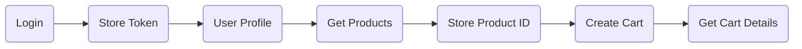

<div align="center">

# 🛒 Ecommerce API Testing Project

### 🚀 API Automation using **Postman**


A complete Postman API testing mini project demonstrating authentication, product retrieval, dynamic variable handling, cart creation, and automated response validation.

---

</div>

# 📌 Project Overview

This project demonstrates an end-to-end API testing workflow for an Ecommerce application using **Postman**.

The collection automates the entire business flow by:

- 🔐 Authenticating a user
- 👤 Fetching user profile
- 📦 Retrieving product information
- 🎯 Dynamically selecting Product IDs
- 🛒 Creating a shopping cart
- 📋 Verifying cart details
- ✅ Executing automated test validations

---

# 🛠 Tech Stack

| Tool | Purpose |
|------|----------|
| Postman | API Development & Testing |
| REST API | HTTP Requests |
| JavaScript | Test Automation Scripts |
| JSON | Request & Response Body |

---

# 📂 Project Structure

```
📁 EcommerceAPI
│
├── Authentication
│   ├── Login
│   └── User Profile
│
├── Products
│   ├── Get Products
│   └── Fetch Single Product
│
├── Cart
│   ├── Add New Cart
│   └── Cart Details
│
└── Environment Variables
```

---

# 🔄 API Workflow

```text
Login
   │
   ▼
Store Access Token
   │
   ▼
Get User Profile
   │
   ▼
Fetch Products
   │
   ▼
Save Product ID
   │
   ▼
Create Cart
   │
   ▼
Get Cart Details
```

---

# 📡 API Endpoints

| Module | Method | Endpoint |
|---------|--------|----------|
| Login | POST | `/auth/login` |
| User Profile | GET | `/auth/me` |
| Products | GET | `/products` |
| Product Details | GET | `/products/{productId}` |
| Add Cart | POST | `/carts/add` |
| Cart Details | GET | `/carts/{cartId}` |

---

# ⚙ Environment Variables

| Variable | Description |
|----------|-------------|
| `base_URL` | https://dummyjson.com |
| `accessToken` | Stored after Login |
| `productId` | Stored dynamically from Products API |
| `cart_id` | Stored after Cart Creation |

---

# ✅ Automated Test Scenarios

### 🔐 Login

- Status Code Validation
- Extract Access Token
- Save Token into Environment

---

### 👤 User Profile

- Bearer Token Authentication
- Status Code Validation

---

### 📦 Products

- Status Code Validation
- Product List Validation
- Dynamic Product ID Extraction

---

### 🛒 Add Cart

- Status Code Validation
- Verify Cart Contains Products
- Store Cart ID

---

### 📋 Cart Details

- Status Code Validation
- Validate Cart Total

---

# 🚀 Features

✅ Dynamic Environment Variables

✅ Token-Based Authentication

✅ API Chaining

✅ Automated Test Assertions

✅ JavaScript Test Scripts

✅ Clean Collection Structure

✅ Reusable Requests

---

# 📷 Workflow



---

# ▶ How to Run

### 1. Clone Repository

```bash
git clone https://github.com/yourusername/EcommerceAPI.git
```

### 2. Open Postman

Import:

- Collection
- Environment

### 3. Set

```
base_URL
```

### 4. Run Collection

Use the **Collection Runner**.

---

# 📈 Learning Outcomes

This project demonstrates:

- REST API Testing
- Postman Collections
- Environment Variables
- Authentication
- Dynamic Data Handling
- JavaScript Assertions
- API Chaining
- Automated Validation

---

# 🌟 Future Improvements

- Newman CLI Integration
- HTML Test Reports
- Jenkins CI/CD Pipeline
- GitHub Actions
- Data Driven Testing
- API Performance Testing

---

# 👨‍💻 Author

**Subham Bera**

Guidewire QA Engineer • API Testing • Automation Testing • Playwright Learner

---

<div align="center">

### ⭐ If you found this project useful, consider giving it a Star!

Made with ❤️ using **Postman**

</div>
